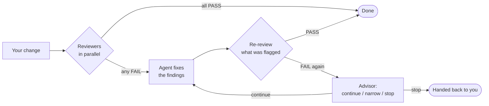

<p align="center">
  <picture>
    <source media="(prefers-color-scheme: dark)" srcset="https://raw.githubusercontent.com/Suge8/firecode/main/design/brand/logo-dark.svg">
    
  </picture>
</p>

<p align="center">Parallel sub-agents and adversarial code review for <a href="https://pi.dev">Pi</a> — light, persistent, calm in the terminal.</p>

<p align="center">
  <a href="https://www.npmjs.com/package/pi-firecode"></a>
  <a href="https://github.com/Suge8/firecode/actions/workflows/ci.yml"></a>
  <a href="LICENSE"></a>
  · <a href="README.zh-CN.md">中文</a>
</p>

<p align="center"></p>

## Install

```bash
pi install npm:pi-firecode
```

That's it (Pi 1.1.0 or newer). On first launch FireCode writes its recommended config to `~/.pi/agent/extensions/firecode/config.jsonc`; swap in the models you are logged in to. The interface text is currently in Chinese.

## Try this first

- *"Send three researchers in parallel to summarize `src/`, `test/` and `docs/`, then give me one table."*
- Make a change, then run `/fire-review`.
- Turn on `/fire-watch` and let a cheap model keep an eye on each turn.

## Review that closes the loop

`/fire-review` has several models review your change in parallel. Every finding goes straight back to the agent, the next round re-checks only what was flagged, and an advisor model steps in when failures repeat. A hard round limit keeps it bounded, and progress is saved in the session, so a reload resumes the review.



<p align="center"></p>

When failures repeat, the advisor checks the findings, names the root cause and sets the next step:

<p align="center"></p>

## Sub-agents you can see and steer

The commander (`/fire-master`) hands work to roles you define — each with its own model, thinking level and a fallback chain that takes over in the same session when a provider fails. Results are saved before delivery and re-delivered after a reload. Click any sub-agent above the input box to read its whole run and talk to it directly.

<p align="center"></p>

## A watcher that speaks up only when it matters

`/fire-watch` evaluates each turn with a cheap model and stays silent unless the work drifts, over-engineers or misses a contract — then it says one line.

<p align="center"></p>

## Light by design

Delegation costs context on every request, so FireCode keeps it small. Characters of tool descriptions plus parameter schemas sent to the model (measured October 2026):

| | Delegation tools | Characters |
| --- | --- | --- |
| **FireCode** | 2 | **926** |
| omp | 2 | 3,140 |
| Codex CLI (multi-agent v2) | 6 | 4,766 |
| Codex CLI (multi-agent v1) | 5 | 9,378 |
| pi-subagents | 2–3 | 4,703–23,182 |

Sub-agents run in-process as Pi sessions — no daemons, nothing left behind when Pi exits. The npm package is a single 124 kB bundle.

## How it compares

| | FireCode | Claude Code | Codex CLI | omp | pi-subagents |
| --- | --- | --- | --- | --- | --- |
| Review → fix → re-review loop | Multi-model, advisor, round limit | One pass (`--fix` applies once) | Single reviewer, no fixes | Parallel reviewers, no fix loop | Prompt template, up to 3 rounds |
| Fallback model chain for sub-agents | Yes | Yes | Not found | Yes | No |
| Sub-agent results after a reload | Persisted and re-delivered | Transcripts persist | Resumable, best-effort delivery | Revivable, undelivered results dropped | Background runs keep going |
| Read and steer each sub-agent | Yes | Yes | Yes | Yes | Yes |

Checked against public docs and source in October 2026.

## Everything else

| Feature | Entry | What it does |
| --- | --- | --- |
| Input-box status | automatic | Progress, timer, review round, title, model and context usage live in the input border |
| Turn folding | automatic, `Ctrl+O` | Each request folds into one summary line — time, speed, the last few interim replies |
| Presets | `/preset`, your key bindings | Switch model, thinking level, tools and instructions together |
| Usage | `/quota`, `/tokens` | Claude and Codex subscription quota; local token and cost totals |
| Claude subscription | automatic | Claude Code attribution; one retry on a 401 caused by token rotation |
| OpenAI request layer | `Ctrl+F` | Verbosity, Fast mode, optional native context compaction |

Turn any feature off with `"features": { "<name>": false }` in the config.

## Contributing

See [CONTRIBUTING](.github/CONTRIBUTING.md). MIT © Suge8
