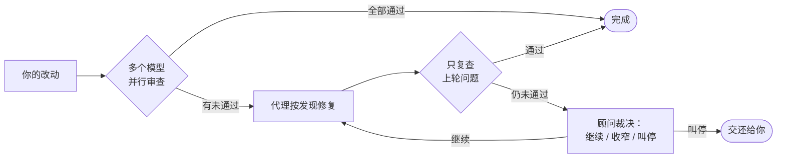

<p align="center">
  <picture>
    <source media="(prefers-color-scheme: dark)" srcset="https://raw.githubusercontent.com/Suge8/firecode/main/design/brand/logo-dark.svg">
    
  </picture>
</p>

<p align="center">给 <a href="https://pi.dev">Pi</a> 的并行子代理与对抗审查扩展：轻、稳，终端里安静不吵。</p>

<p align="center">
  <a href="https://www.npmjs.com/package/pi-firecode"></a>
  <a href="https://github.com/Suge8/firecode/actions/workflows/ci.yml"></a>
  <a href="LICENSE"></a>
  · <a href="README.md">English</a>
</p>

<p align="center"></p>

## 安装

```bash
pi install npm:pi-firecode
```

装完即用（需要 Pi 1.1.0 及以上）。首次启动时 FireCode 会把推荐配置写到 `~/.pi/agent/extensions/firecode/config.jsonc`，把里面的模型换成你已登录的就行。

## 先试试这几句

- “派三个调研员并行，分别总结 `src/`、`test/`、`docs/` 是做什么的，最后给我一张表。”
- 改完代码后执行 `/fire-review`。
- 打开 `/fire-watch`，让便宜模型每回合帮你盯一眼。

## 会自己闭环的审查

`/fire-review` 让多个模型并行审查你的改动。每条发现直接交回给代理修，下一轮只复查上一轮指出的问题；连续不过时由顾问模型出面裁决。轮数有硬上限，进度写进会话，重载后接着审。



<p align="center"></p>

连续不过时，顾问核实发现、判断根因、给出下一步：

<p align="center"></p>

## 看得见、管得住的子代理

指挥官（`/fire-master`）按你定义的角色派活：每个角色有自己的模型、思考档，还有一条备用模型链，某家供应商出故障时在同一个会话里接着跑。结果先存档再投递，重载后重投。点输入框上方任一子代理，就能看它的全过程并直接跟它说话。

<p align="center"></p>

## 只在要紧时开口的观察员

`/fire-watch` 每回合用便宜模型评估一次，平时不出声；发现跑偏、过度工程或违背约定时，才说一句。

<p align="center"></p>

## 轻

委派工具每次请求都要占上下文，所以 FireCode 把它压得很小。下表是发给模型的工具描述加参数结构的字符数（2026 年 10 月实测）：

| | 委派工具数 | 字符数 |
| --- | --- | --- |
| **FireCode** | 2 | **926** |
| omp | 2 | 3,140 |
| Codex CLI（multi-agent v2） | 6 | 4,766 |
| Codex CLI（multi-agent v1） | 5 | 9,378 |
| pi-subagents | 2–3 | 4,703–23,182 |

子代理是进程内的 Pi 会话，没有后台进程，Pi 退出不留残余。npm 包是一个 124 kB 的单文件。

## 和同类工具对比

| | FireCode | Claude Code | Codex CLI | omp | pi-subagents |
| --- | --- | --- | --- | --- | --- |
| 审查 → 修复 → 复审循环 | 多模型、顾问裁决、轮数上限 | 单次（`--fix` 修一次） | 单个审查者，不修复 | 并行审查，不回流修复 | 提示词模板，最多 3 轮 |
| 子代理备用模型链 | 有 | 有 | 未找到 | 有 | 无 |
| 重载后子代理的结果 | 持久化并重投 | 记录保留 | 可续派，尽力投递 | 可复活，无人接收的结果丢弃 | 后台运行不受影响 |
| 查看并干预每个子代理 | 能 | 能 | 能 | 能 | 能 |

依据 2026 年 10 月的公开文档与源码。

## 其它功能

| 功能 | 入口 | 做什么 |
| --- | --- | --- |
| 输入框状态 | 自动 | 进度、计时、审查轮次、标题、模型与上下文占用都在输入框边框里 |
| 过程折叠 | 自动，`Ctrl+O` | 每次请求折成一行摘要：耗时、均速、最近几条中间回复 |
| 预设 | `/preset`、你配的快捷键 | 一起切换模型、思考档、工具集与附加指令 |
| 用量 | `/quota`、`/tokens` | Claude、Codex 订阅剩余额度；本地 token 与成本统计 |
| Claude 订阅适配 | 自动 | 请求带 Claude Code 归因；令牌换发导致的 401 自动重试一次 |
| OpenAI 请求层 | `Ctrl+F` | 回答详略、加速档、可选的原生上下文压缩 |

在配置里写 `"features": { "<名字>": false }` 关掉任一功能。

## 参与开发

见 [CONTRIBUTING](.github/CONTRIBUTING.md)。MIT © Suge8
